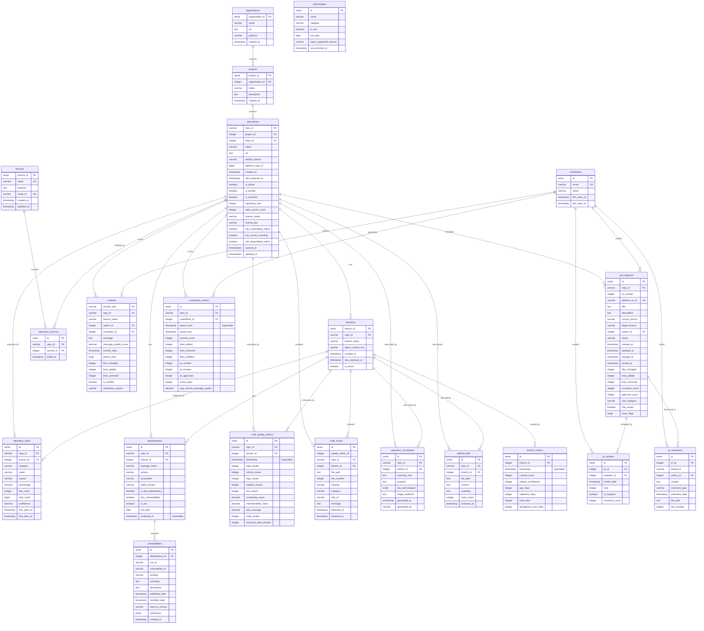

# Data Storage Layer

## Overview

The storage layer uses PostgreSQL with TimescaleDB extension for efficient time-series data handling and comprehensive querying capabilities for Grafana.

## Database Setup

The system requires PostgreSQL 15 with the TimescaleDB extension enabled. Additional extensions `pg_trgm` and `btree_gin` are used for text search and indexing.

**Schema Location**: See [database/schema.sql](../database/schema.sql) for the complete DDL.

## Database Schema

### Entity Relationship Diagram

> **Note**: The rendered SVG below is auto-generated from the Mermaid source.
> Source file: [../images/database-schema.mmd](../images/database-schema.mmd)
> To regenerate: Actions → Update-Docs Bot → Run workflow (`mermaid` job).

The inline Mermaid source (also renders in GitHub and VS Code):

### Core Entity Tables

The foundation of the data model consists of hierarchical entities:

- **organizations**: Top-level Azure DevOps organizations with name and URL
- **projects**: Projects within organizations, linked by foreign key
- **repositories**: Individual repos with Azure DevOps ID as primary key, tracking default branch and last analysis timestamp
- **branches**: Branch metadata per repository, tracking latest commit SHA and analysis status

### Language and Dependency Tables

These tables track the technology makeup of each repository:

- **repository_stack**: Unified table storing all per-repository technology data. Rows with `source='platform_api'` and `category='language'` come from the VCS API (byte counts, percentages). Rows with `source='heuristic'` come from the TechnologyDetector (frameworks, databases, CI/CD, etc.).
- **technologies**: Global EOL metadata lookup table, one row per `(name, category)`. Populated by `TechnologyEnricher` from endoflife.date.
- **dependencies**: Package information including name, version, ecosystem (PyPI, npm, Maven, NuGet), and security flags (`has_vulnerabilities`, `is_eol`). Also a hypertable for time-series tracking.
- **vulnerabilities**: CVE and OSV vulnerability records linked to dependencies, storing severity, description, and fix version.

### Code Quality Tables

Quality metrics are stored as time-series data for trend analysis:

- **code_quality_metrics**: Aggregated counts of issues by severity, plus complexity scores, maintainability index, test coverage, and technical debt. Hypertable with weekly chunks.
- **code_issues**: Individual issue records with file path, line number, category (bug, vulnerability, code_smell), and resolution status.

### Repository Summary Tables

AI-generated insights and documentation:

- **repository_summaries**: LLM-generated summaries including purpose, key technologies (as array), and target audience. Tracks which model generated each summary.
- **readme_files**: Extracted README content with full-text search index using PostgreSQL's `gin` and `tsvector`.

### Contributor and Activity Tables

Developer metrics and commit history:

- **contributors**: Unique contributors identified by email, with first/last seen timestamps
- **contributor_metrics**: Time-series metrics per contributor per repository, including commit counts, lines changed, PR activity, and commit message quality scores. Monthly hypertable.
- **commits**: Individual commit records with author, message, quality score, and change statistics.

### Pull Request Tables

PR lifecycle and review tracking:

- **pull_requests**: PR metadata including branches, status, timestamps, size metrics, and issue flags
- **pr_reviews**: Individual review records with vote values (-10=rejected, 0=no vote, 5=approved with suggestions, 10=approved)
- **pr_comments**: Thread and comment content with optional file/line associations

### Branch Metrics

Branch-level analytics as time-series:

- **branch_metrics**: Tracks commit count, unique contributors, age, staleness, and divergence from main branch. Weekly hypertable.

### Service Tables

Services represent logical groupings of repositories that together deliver a business capability:

- **services**: Defines services with a unique name, purpose description, and CMDB identifier for integration with configuration management systems. Each service can aggregate metrics from multiple repositories.
- **repository_services**: Junction table implementing the many-to-many relationship between repositories and services. A repository may belong to zero or more services (e.g., an API repo and its database repo both belong to a "user" service), and a service may have zero or more repositories.

## Indexing Strategy

The schema employs several indexing patterns:

- **Foreign key indexes**: All relationship columns indexed for join performance
- **Timestamp indexes**: Time-based columns indexed for range queries
- **Composite indexes**: Common query patterns pre-optimized (e.g., `repo_id + timestamp DESC`)
- **Partial indexes**: Security-focused index on dependencies where vulnerabilities or EOL flags are true
- **Full-text search**: GIN index on README content for text search

## Data Access Layer

The application uses SQLAlchemy for ORM mapping and `psycopg2` for efficient database connections. A `Database` class handles connection pooling and transaction management.

## Backup and Restore

### Backup Strategy

- **Daily backups**: `pg_dump` in custom format, compressed with gzip
- **Storage**: Uploaded to Azure Blob Storage
- **Retention**: 7 days local, 30 days cloud

### Restore Process

1. Download backup from Azure Blob Storage
2. Decompress the archive
3. Use `pg_restore` to populate a clean database instance

### Point-in-Time Recovery

PostgreSQL is configured with WAL archiving (`wal_level = replica`, `archive_mode = on`) to support point-in-time recovery for disaster scenarios.

## Data Retention and Archival

- **Archival threshold**: Data older than 2 years is moved to archive tables
- **Compression**: TimescaleDB chunks older than 6 months are compressed to reduce storage

## Checklist

- [ ] PostgreSQL 15+ installed with TimescaleDB extension
- [ ] Extensions enabled: `timescaledb`, `pg_trgm`, `btree_gin`
- [ ] Schema applied from `database/schema.sql`
- [ ] Read-only user created for Grafana
- [ ] Connection pooling configured
- [ ] Backup automation configured
- [ ] WAL archiving enabled for PITR

## Further Reading

- [TimescaleDB Documentation](https://docs.timescale.com/)
- [PostgreSQL Indexing Best Practices](https://www.postgresql.org/docs/current/indexes.html)
- [SQLAlchemy ORM Tutorial](https://docs.sqlalchemy.org/en/20/orm/tutorial.html)

## Next Steps

- See [job-orchestration.md](job-orchestration.md) for data insertion workflows
- Review [../03-operations/visualization.md](../03-operations/visualization.md) for querying this data in Grafana
